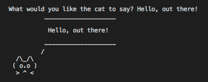

## Python for Beginners - Processed exercises

Solutions for the exercises from Udemy-Course [Python for Beginners: Learn Python Programming (Python 3)](https://www.udemy.com/python-programming-projects/).

### Data Structures

**01**: Create a Python program that captures and displays a person's to­do list. Continually prompt the user for another item until they enter a blank item. After all the items are entered, display the to­do list back to the user.

**02**: Create a dictionary that contains a list of people and one interesting fact about each of them. Display each person and their interesting fact to the screen. Next, change a fact about one of the people. Also add an additional person and corresponding fact. Display the new list of people and facts. Run the program multiple times and notice if the order changes.

**03**: Create a list of airports which includes tuples. The tuples contain an airport's name and it's code. Iterate through the list and use tuple assignment. Use one variable to hold the name of the airport and another variable to hold the airport code. Print the name and the code to the screen.

### Data Types

**01:** Write a Python program which uses three variables. The variables in your program shall be animal, vegetable, and mineral. Assign a value of type string to each variable. Your program shall display "Here is an animal, a vegetable, and a mineral." Then, display the value for animal, followed by the vegetable, and then the mineral. Each on it's own line.

**02:** Write a Python program which prompts the user for input. Then repeats what the user entered.

**03:** Write a Python program which prompts for input. And then displays a cat which "says" what the user had entered.

**04:** You are planning to start a social networking service. You decide to host your application on a cloud-service. The hosting provider charges 0.51 dollar per hour. You want to know how much it will cost to operate per day and per month.
Write a Python script that displays the answers to the following questions: How much does it cost to operate a server per day?
How much does it cost to operate a server per month?

**05:** Please see exercise 04.

Let's assume that you have saved 918 dollar to pay for the cloud-service. You ask yourself how many days you can keep one server running before your money runs out. But: If your social network becomes popular then it will require 20 servers to keep up with the demand. How much will it cost to operate twenty servers?
Write a Python program that displays the answers to the following questions:

- How much does it cost to run one server per day?

- How much does it cost to run one server per month?

- How much does it cost to run twenty servers per day?

- How much does it cost to run twenty servers per month? How many days can I operate one server with $918?

**06**: Write a program that asks the user how far he/she wants to travel. If the answer is less than three miles tell the user to walk. If more than three miles, but less than three hundred miles, tell the user to drive. If more then 300 miles then tell the user to fly.

### Files and Modules

**01**: Write a program that opens the given file 'dummy.txt'. Read and print the lines of the file and prepend each with a line number.

**02**: Read the content of the given file 'animals.txt'. Write the lines **sorted** into a newly created file 'animals-sorted.txt'.

**03**: Update the "cat says" script from the secion 'Data Types'. So that it can be run directly or imported as a module. When it runs as a program is should prompt for input and display a cat repeating what was provided by the user. Then create a script which imports the "cat says" module. Use a function from "cat says" to display messages on the screen.

### Functions

**01**: Create a fill in the blank word game.

Prompt the user to enter a noun, verb, and an adjective. Use those responses to fill in the blanks and display the story.
Write a short story. Remove a noun, verb, and an adjective. Create a function to get the input from the user.
Create a function that fills in the blanks in the story you created. Ensure each function contains a docstring.
After the noun, verb, and adjective have been collected from the user, display the story using their input.
